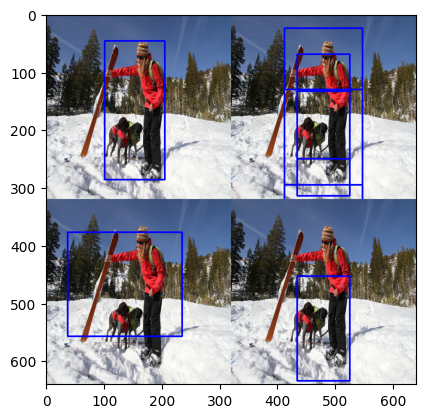
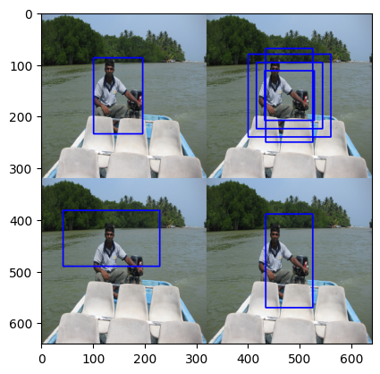
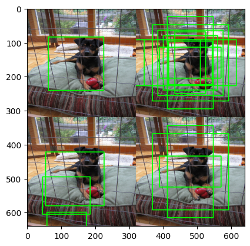

# SSD-object-detection

The final boxes are arrived after non-max suppression done for the predicted boxes. The performance was measured by generating mAP and calculated the score by calculating its area.

The left handside images in each image are the final detected boxes of Ground truth and Prediction. While the righthandside boxes in each image are box defaults for the respective data that has IOU of atleast 0.5 with label objects.

